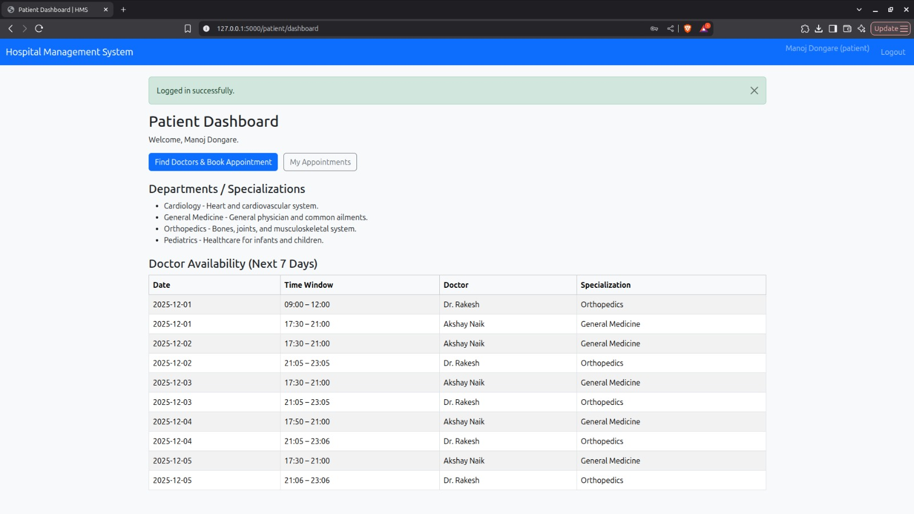
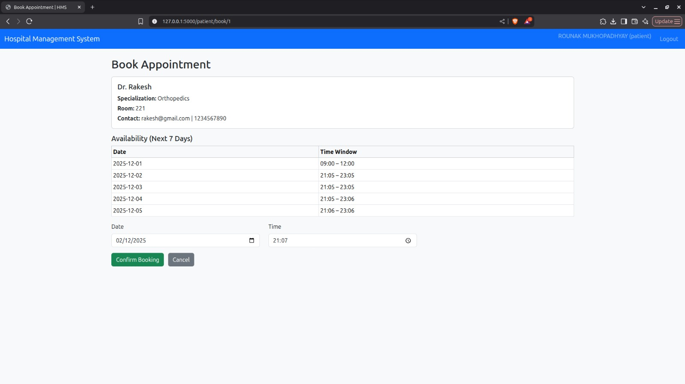
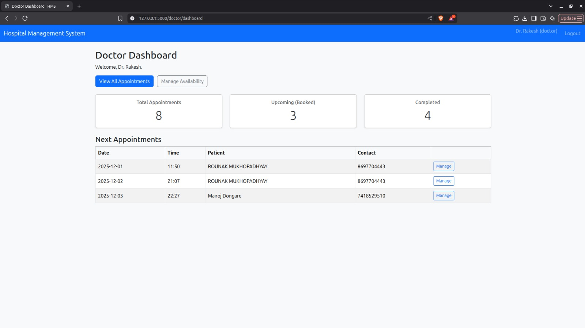
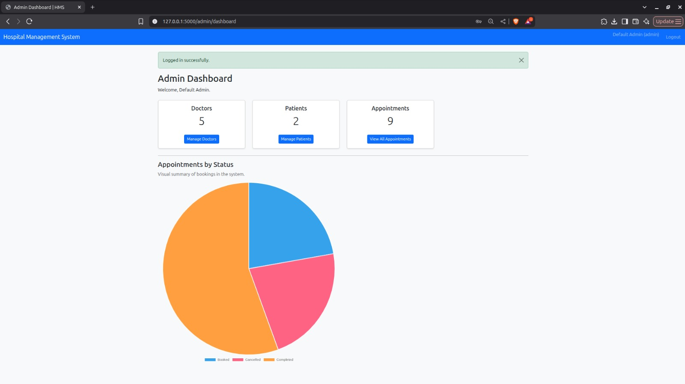

# 🏥 Hospital Management System (HMS)

A full-stack **role-based web application** built using **Flask + SQLite** for managing hospitals efficiently.  
It supports **Admin, Doctor and Patient** workflows including appointment booking, doctor availability, treatment history, and medical record tracking.

---

## Key Features

| Role        | Features                                                                                        |
| ----------- | ----------------------------------------------------------------------------------------------- |
| **Admin**   | Manage doctors & patients, view all appointments, blacklist users, view statistics graph        |
| **Doctor**  | View appointments, mark Completed/Cancelled, manage availability, add treatment details         |
| **Patient** | Self-register, search doctors, book/cancel appointments, view prescriptions + diagnosis history |

---

## Tech Stack

| Component      | Technology             |
| -------------- | ---------------------- |
| Backend        | Flask                  |
| Database       | SQLite                 |
| Frontend       | HTML + CSS + Bootstrap |
| Templates      | Jinja2                 |
| Visualization  | Chart.js               |
| Authentication | Werkzeug Security      |

---

## 📂 Project Screens (UI Preview)

### Login Page


### Patient Dashboard



### Book Appointment



### Doctor Dashboard



### Treatment Form


### Admin Dashboard



### All Appointments (Admin)


---

## Installation & Setup

### 1. Clone the Repository

```bash
git clone https://github.com/ron-desa/Hospital-Management-System.git
cd hospital_app_22f1000876
```

### 2. Create Virtual Environment (Recommended)

```bash
python3 -m venv .venv
source .venv/bin/activate   # Mac/Linux
# OR
.\.venv\Scripts\activate    # Windows
```

### 3. Install Dependencies

```bash
pip install -r requirements.txt
```

### 4. Run the Application

```bash
python app.py
```

Application will run at:

```bash
http://127.0.0.1:5000
```

## Default Login Credentials

| Role    | Username            | Password |
| ------- | ------------------- | -------- |
| Admin   | admin               | admin123 |
| Doctor  | (created by admin)  | —        |
| Patient | (self-registration) | —        |

## How to Use

- Patient registers → logs in

- Searches doctors → books appointment

- Doctor logs in → views schedule → marks status

- Doctor adds treatment: diagnosis + prescription

- Patient views complete treatment history

- Admin monitors global activity from dashboard

## Project Structure

```bash
hospital_app/
├── app.py
├── controllers/routes.py
├── models/models.py
├── templates/*.html
├── static/css,js
├── instance/hospital.db
└── screenshots/*.jpeg
```

## Future Scope

#### SMS/email appointment reminders

#### Upload/test medical reports

#### Mobile app integration

#### Prescription PDF generator

## Author

### Rounak Mukhopadhyay

### Roll: 22f1000876
